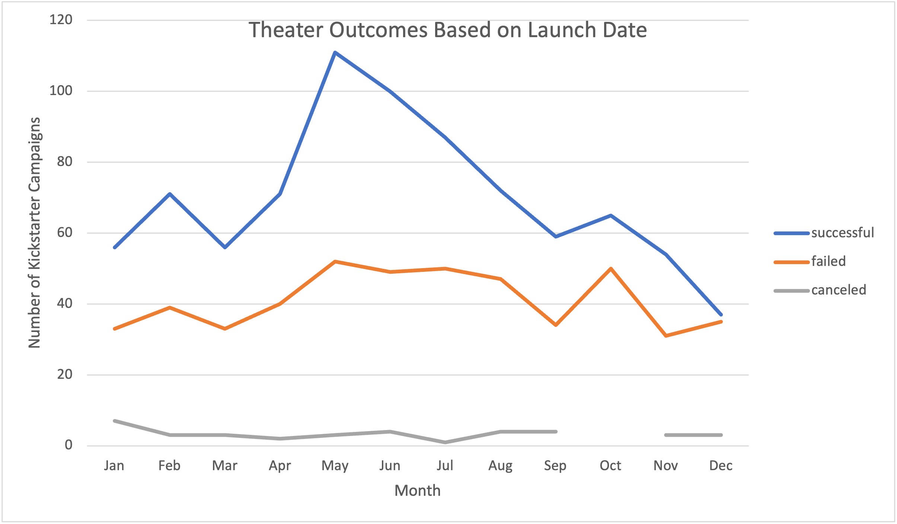

# Kickstarting with Excel

## Overview of Project
In this project we examine data of Kickstarter outcomes for theater projects. This is done in two categories: all theater projects and a subcategory of theater projects: plays.

### Purpose
The purpose of this project is to guide one in creating and carryingout a successful Kickstater campaign for theater/play projects. The following analysis will provide insight regarding the best time of the year to launch the Kickstarter campaign and the best financial goal to set for the cmapaign. All analyses are based on data from the "Kickstarter" worksheet in [Kickstarter_Challenge.xlsx](Kickstarter_Challenge.xlsx).

## Analysis and Challenges
The data for the *theater* category is taken from the years 2009 to 2017.

### Analysis of Outcomes Based on Launch Date
To analyze *Outcomes based on launch date*, we examine variation in success rates of all theater projects throughout the year (month to month). The following graph displays these findings:

### Analysis of Outcomes Based on Goals

### Challenges and Difficulties Encountered

## Results

- What are two conclusions you can draw about the Outcomes based on Launch Date?

- What can you conclude about the Outcomes based on Goals?

- What are some limitations of this dataset?

- What are some other possible tables and/or graphs that we could create?
