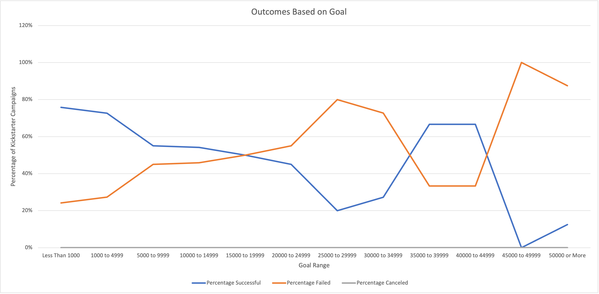

# Kickstarting with Excel

## Overview of Project
In this project we examine data of Kickstarter outcomes for theater projects. This is done in two categories: all *theater* projects and *plays*, a subcategory of *theater*.

### Purpose
The purpose of this project is to guide one in designing and carrying out a successful Kickstater campaign for theater projects. The following analysis will provide insight regarding the best time of the year to launch the Kickstarter campaign and the best financial goal to set for the campaign. All analyses are based on data from the "Kickstarter" worksheet in [Kickstarter_Challenge.xlsx](Kickstarter_Challenge.xlsx).

## Analysis and Challenges
The data for the *theater* category is taken from the years 2009 to 2017.

### Analysis of Outcomes Based on Launch Date
To analyze *outcomes based on launch date*, we examine variation in success rates of all theater projects throughout the year (month to month). The following graph displays these findings:

As can be seen, May has the greatest number of successful projects, and that number diminishes throughout the rest of the year (though there is a slight rebound in October). The maximum number of successes is approximately 110 in May vs approximately 70 in February. The number of failed projects roughly bounces around the 40 mark throughout the year (minimum ~35, maximum ~50). There were few canceled *theater* projects.

### Analysis of Outcomes Based on Goals
To analyze *outcomes based on goals* we examine variation in percent of successes/failures of projects according to financial goal. Projects are categorized in bins with a $5,000 range. The following graph displays those findings:

Generally the likelihood of success of a *play* project diminishes as the goal of that project increases. In fact, in all but the $35,000 to $45,000 range projects above a $15,000 goal are more likely to fail than succeed. (This exception to be discussed below.) Goals less than $5,000 are approximately 75% likely to succeed, while likelihood of success drops to approximately 55% above $5,000. There were no canceled *play* projects.

### Challenges and Difficulties Encountered
Several challenges or difficulties arise in interpreting the above analyses:

1. It is easy for one to arrive at the conclusion that a campaign should be launched in May or June according to the first graph above. However, while we are certain as to the number of successes in May and June, we are *not* certain as to the cause of this fact. For one thing, there are simply more campaigns during these months. *Why is this?* That inquiry requires data and other knowledge outside the scope of this project. There may yet be an underlying reason for these successes in these months that is not strictly tied to the time of year.
2. In the *outcomes based on goal* analysis, there is a spike in the percentage of successful projects in the $35,000 - $45,000 range. However, on closer examination of the data, these two bins amount to only 9 projects total (6 successes, 3 failures). In the $0 to $5,000 range there are a total of 720 projects. In fact as the bins increase in value, the number of projects in those bins diminishes. This suggests that this spike of successes from $35,000 to $45,000 (with only 9 projects) is probably *not* due to the project goal, and therefore should not be interpreted as such.
3. These two separate analyses begs the question *How does the outcome of a project depend on project goal **and** time of year?* That is, we have examined outcome according to launch date and goal separately. Yet it might behoove us to examine outcomes based on goal in *each month*, rather than overall.

## Results

- The best time to launch a *theater* project is in May or June. July and August projects are not as likely to succeed, but would still be reasonable.

- December is the worst time to launch a *theater* campaign, seeing almost and equal number of successed as failures.

- It is most advisable to set a goal less than $5,000. The vast majority of projects with these lower goals succeed. As one increases a project's goal, generally it is more likely to fail.

- What are some limitations of this dataset?

- What are some other possible tables and/or graphs that we could create?
1. 
